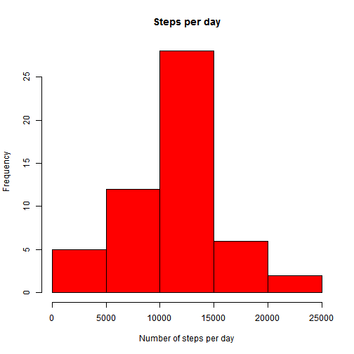
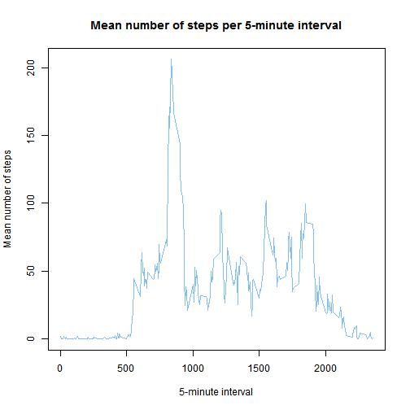
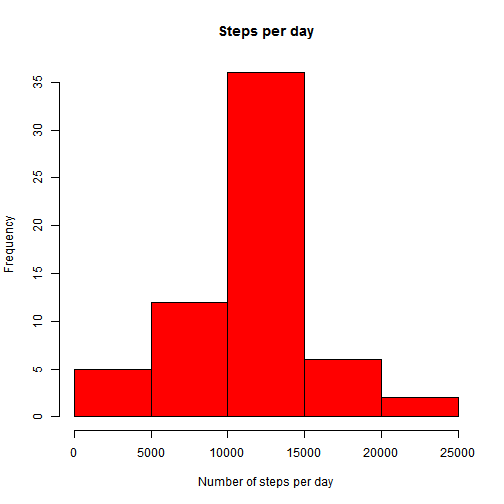
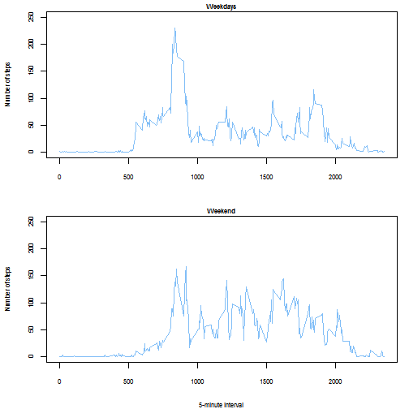

# Peer assignment 1

In this document I will answer the questions of peer assignment 1 for the Reproducible Research course of Coursera. To make the document easy to follow, I will use the same layout as in the assignment and repeat the questions.


### Loading and preprocessing the data
This section contains 2 assignments:  

- *Load the data (i.e. read.csv())*  
I will load the data from the working directory.


```r
data<- read.csv("./activity.csv")
```

- *Process/transform the data (if necessary) into a format suitable for your analysis*  
First, I will change the class of the date variable from Factor to Date


```r
data$date<-as.Date(data$date, format = "%Y-%m-%d")
```

Secondly, I will change my system settings, so in the last section weekdays appear in English 


```r
Sys.setlocale("LC_ALL","C")
```

Finally, I want to open the dplyr package


```r
library(dplyr)
```

### What is mean total number of steps taken per day?
This section contains 3 assignments:  

- *Calculate the total number of steps taken per day*

```r
stepsperday<- summarise(group_by(data, date),sum(steps))  
names(stepsperday) <- c("date","steps")
```

- *Make a histogram of the total number of steps taken each day*

```r
hist(stepsperday$steps, col="red", main="Steps per day", xlab="Number of steps per day")
```

 

- *Calculate and report the mean and median of the total number of steps taken per day*

```r
mean(stepsperday$steps, na.rm=TRUE)  
```

```
## [1] 10766.19
```

```r
median(stepsperday$steps, na.rm=TRUE)
```

```
## [1] 10765
```

As is shown above, the **mean** number of steps taken per day is 10766.19. The **median** number of steps is slightly lower with 10765.

### What is the average daily activity pattern?
This section contains 2 assignments:  

- *Make a time series plot (i.e. type = "l") of the 5-minute interval (x-axis) and the average number of steps taken, averaged across all days (y-axis)*


```r
avsteps<-aggregate(steps~interval,data=data,mean, na.rm=TRUE)  
plot(avsteps$interval, avsteps$steps, type="l", col="#81BEF7", main="Mean number of steps per 5-minute interval", xlab="5-minute interval", ylab="Mean number of steps")
```

 

- *Which 5-minute interval, on average across all the days in the dataset, contains the maximum number of steps?*

```r
max<-avsteps[which.max(avsteps$steps),1]
max
```

```
## [1] 835
```

As shown above, on average, the maximum number of steps is taken in 5-minute interval 835.

### Imputing missing values
This section contains 4 assignments: 

- *Calculate and report the total number of missing values in the dataset (i.e. the total number of rows with NAs)*  

```r
sum(is.na(data))
```

```
## [1] 2304
```

There are 2304 missing values in the dataset

- *Devise a strategy for filling in all of the missing values in the dataset. The strategy does not need to be sophisticated. For example, you could use the mean/median for that day, or the mean for that 5-minute interval, etc.*  
The strategy I decided to use is to replace the missing values with the mean for that 5-minute interval

- *Create a new dataset that is equal to the original dataset but with the missing data filled in.*

```r
data2<-data %>% group_by(interval) %>% mutate(steps= replace(steps, is.na(steps), mean(steps, na.rm=TRUE)))
```

- *Make a histogram of the total number of steps taken each day and Calculate and report the mean and median total number of steps taken per day. Do these values differ from the estimates from the first part of the assignment? What is the impact of imputing missing data on the estimates of the total daily number of steps?*  

First, I will create the histogram.  

```r
stepsperdaynew<- summarise(group_by(data2, date),sum(steps))  
names(stepsperdaynew) <- c("date","steps")  
hist(stepsperdaynew$steps, col="red", main="Steps per day", xlab="Number of steps per day")
```

 

Secondly, I will calculate the mean and median of the imputed data.


```r
mean(stepsperdaynew$steps, na.rm=TRUE)  
```

```
## [1] 10766.19
```

```r
median(stepsperdaynew$steps, na.rm=TRUE)
```

```
## [1] 10766.19
```

The **mean** of the imputed dataset is 10766.19. This is the same mean as in the dataset with the missing values.  
The **median** of the imputed dataset is now also 10766.19. The median is slightly higher compared to the dataset with the missing values: it increased from 10765 to 10766.19  
The imputation of the missing values increased the **total daily number of steps**.

### Are there differences in activity patterns between weekdays and weekends?
This section contains 2 assignments:  

- *Create a new factor variable in the dataset with two levels - "weekday" and "weekend" indicating whether a given date is a weekday or weekend day.*


```r
data2<-mutate(data2,day=weekdays(date))
```

- *Make a panel plot containing a time series plot (i.e. type = "l") of the 5-minute interval (x-axis) and the average number of steps taken, averaged across all weekday days or weekend days (y-axis). See the README file in the GitHub repository to see an example of what this plot should look like using simulated data.*  

Before creating the panel plot, I will make some changes in the dataset. I will add a new variable indicating weekdays and weekend days. Then I will create a separate file with the data for the weekdays and the weekend days. Finally, I will aggregate the data in these two dataframes to compute the mean per interval.


```r
weekdays <- c("Monday", "Tuesday", "Wednesday","Thursday", "Friday", "Saturday", "Sunday")  
weekdays2 <- factor(c("weekday","weekday","weekday","weekday","weekday","weekend","weekend"))    
data2$day2 <- weekdays2[ match(data2$day, weekdays) ]  
dataweek<-filter(data2, day2=="weekday")  
dataweekend<-filter(data2, day2=="weekend")  
dataweek<-aggregate(steps~interval,data=dataweek,mean)  
dataweekend<-aggregate(steps~interval,data=dataweekend,mean)
```

Then I will create the panel plot.  


```r
par(mfrow=c(2,1),mar = c(4,4,1,1))  
plot(dataweek$interval, dataweek$steps, type="l", col="#81BEF7", main="Weekdays", xlab="", ylab="Number of steps",ylim=c(0,250), cex.axis=0.7,cex.lab=0.7,cex.main=0.7)  
plot(dataweekend$interval, dataweekend$steps, type="l", col="#81BEF7", main="Weekend", xlab="5-minute interval",ylim=c(0,250), ylab="Number of steps",cex.axis=0.7,cex.lab=0.7,cex.main=0.7)
```

 

As can be seen in the panel plot, there is a difference in the activity pattern between weekdays and weekend days. On weekdays, activity starts earlier peaks in the morning around 8.30 AM. On weekend days, the activity starts later in the morning, but remains on a higher level during the day.
